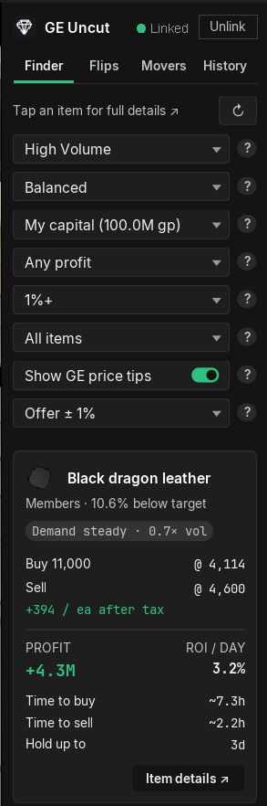
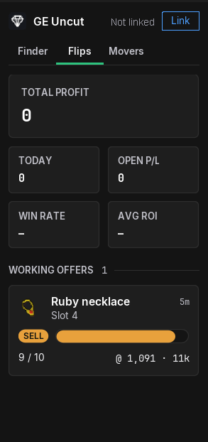
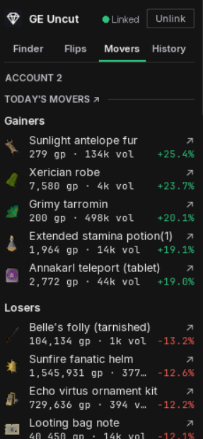
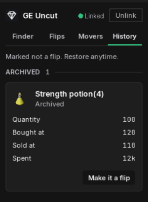
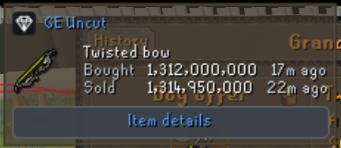
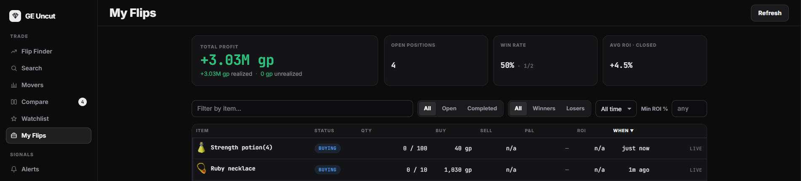

# GE Uncut

**Find profitable OSRS flips in seconds, price them on the offer screen, and track your profit automatically. Right inside RuneLite.**

Free. Backed by the full [geuncut.app](https://geuncut.app) toolkit.

The panel is four tabs, all at RuneLite's native look:

|  |  |  |
|:--:|:--:|:--:|
|  |  |  |
| **Flips:** your stats, live GE slots with offer timers, and tracked positions | **Movers:** the day's gainers and losers with price and volume | **History:** buys you marked "not a flip", restorable in one tap |

---

The full toolkit (flip finder, movers, market news, item pages, and the AI assistant) lives at [geuncut.app](https://geuncut.app). The plugin brings the essentials in-client.

## Prices where you set the offer

Open a buy or sell offer and the plugin brings the live market to the offer screen. A one-tap option drops the current price into the box, with quick step-up and step-down amounts around it, so you can take a faster fill or hold out for a wider margin without doing the math. A small on-screen panel shows the item's live buy and sell price and how recently each side last traded, so you always price against the real market. It works for any item, with or without an account.

## Automatic profit tracking

Link your account and the plugin reports your own GE offer fills, so every flip tracks itself in "My Flips" on geuncut.app. No spreadsheets, no manual entry. It also mirrors your live GE slots (working offers) with the game's own offer timers.

Trades made on mobile happen with RuneLite closed, so the plugin never sees them live. With the Grand Exchange open the panel shows a short line pointing you at the in-game History tab. Open that tab once and the plugin reads the rows, works out which offers it has no record of, and adds just those. Opening it again changes nothing.

## Linking (optional)

Fully usable without an account. Linking adds members-item flips and cross-device profit tracking. Click **Link account**, enter the short code shown at `geuncut.app/link`, and you are connected. The plugin never sees your RuneScape or geuncut.app password. **Unlink** revokes the token on the server and clears it from the client, so an unlinked device stops resolving immediately.

## Privacy

**Nothing is sent to any server until you link an account.** Unlinked, the plugin only fetches the public flip list (the same anonymous scan the website serves) and does its buy-limit and working-offers tracking locally.

Once linked, the plugin talks to `geuncut.app` only, over HTTPS, using your personal token. It sends your non-reversible OSRS account hash (used to attribute your offers, not your username), your own GE offer fills, and a snapshot of your current GE slots. No credentials are ever transmitted. Every endpoint lives under `https://geuncut.app/api/plugin/`: `flips`, `positions`, `ge-events`, `offers`, `link/start`, `link/poll`, and `link` (unlink).

## Building

Standard RuneLite external plugin. `./gradlew build` compiles and tests; `./gradlew run` launches a developer-mode client with the plugin loaded.

## License

BSD 2-Clause. See [LICENSE](LICENSE).