# GE Uncut

**Find profitable OSRS flips in seconds, track your profit automatically, and never miss a buy-limit reset. Right inside RuneLite.**

Free. Privacy-first. Backed by the full [geuncut.app](https://geuncut.app) toolkit.

<!-- PANEL SCREENSHOT (hero): the RuneLite side panel, linked, showing the ranked
     flips and working offers. Capture from your client and save it here. -->

---

## Flips that actually fill, ranked for your gold

A live, ranked list of what is worth flipping right now: buy price, quantity, after-tax margin, ROI per day, demand trend, and realistic fill times. Free-to-play flips need no account. Link one to unlock members items.

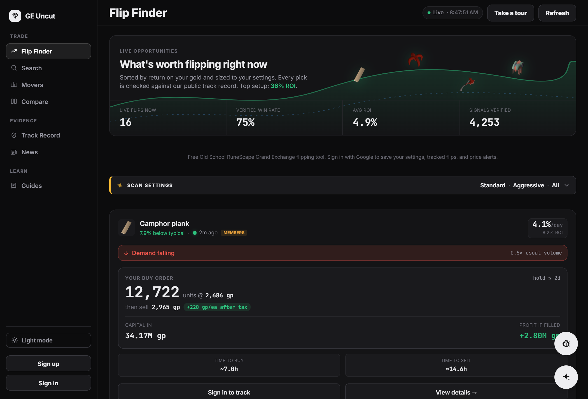

## The GE Uncut Assistant does the digging

Ask "what should I flip right now?" and the GE Uncut Assistant tailors picks to your bankroll and membership, in plain English. It reads live prices, item history, the public track record, and OSRS wiki facts, then hands you the answer.

Try asking:

- *"Find me a fast flip, I have 5M and I'm free-to-play"*
- *"How is the strategy doing this week?"*
- *"Show my open positions"*
- *"What's the price history for a Twisted bow?"*
- *"How does the GE tax and buy limit work?"*

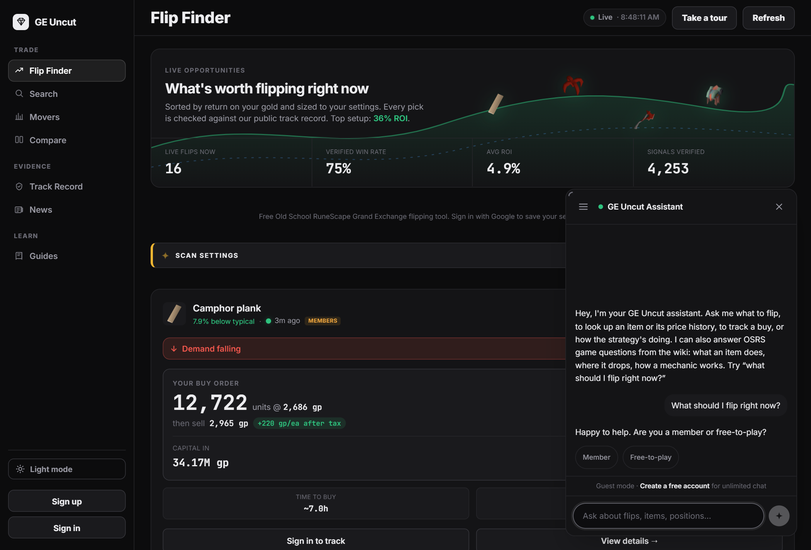

## Know the market before it moves

|  |  |
|:--:|:--:|
| 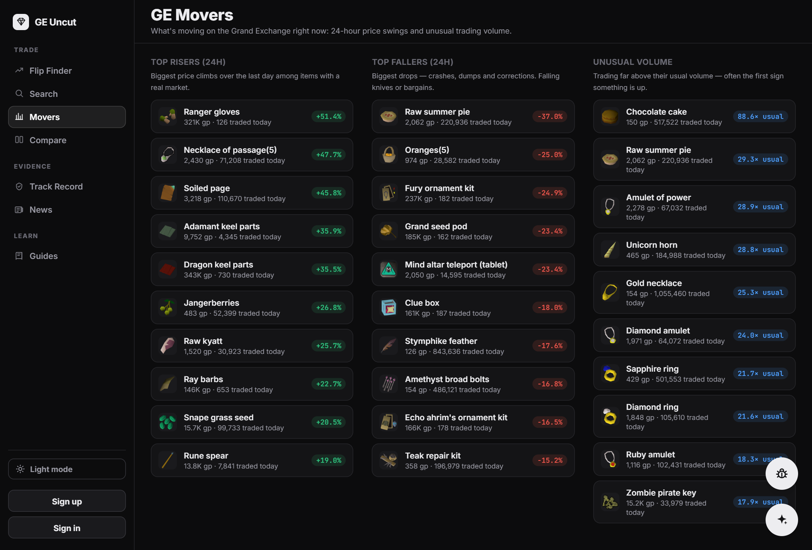 | 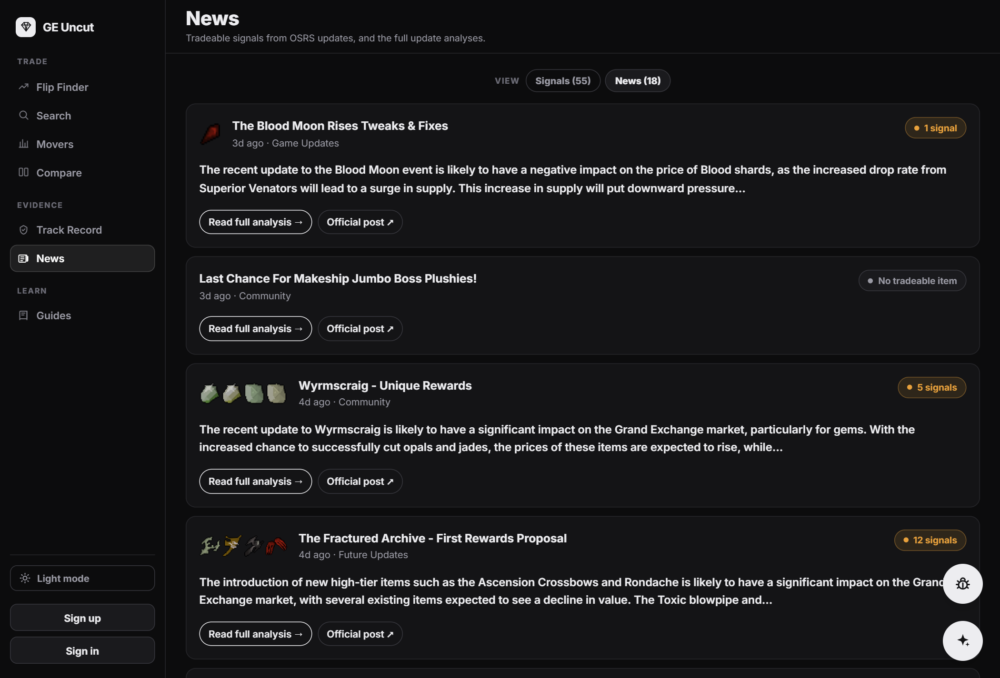 |
| **GE Movers:** the day's biggest risers, fallers, and volume spikes | **Market news:** game updates scored for the items likely to move |

Every update is mapped to the specific items it moves, scored by direction and confidence, right on the item's page.

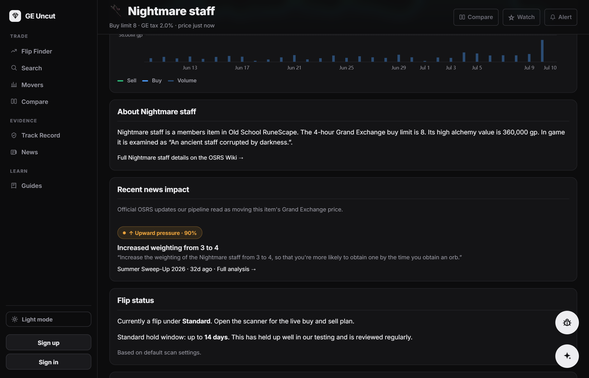

## Proof, not promises

Every signal we publish is scored against real prices later, wins and losses alike. The whole record is public, so you can see exactly how the strategy performs.

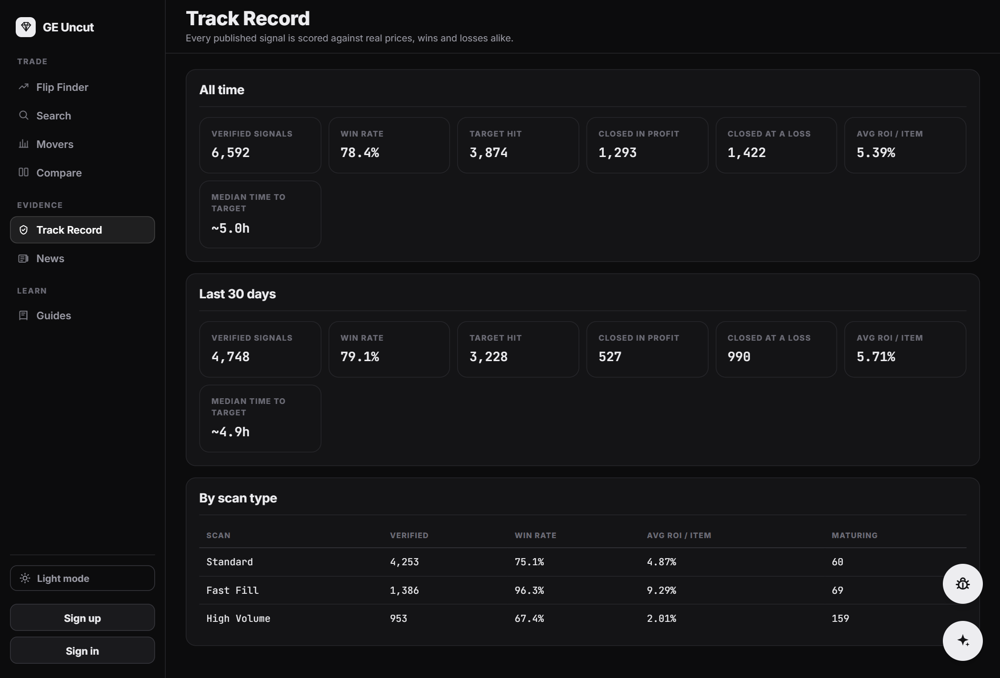

And it goes item by item. Every flip carries its own forward-tested record, so you can see how the item you are about to buy has actually performed.

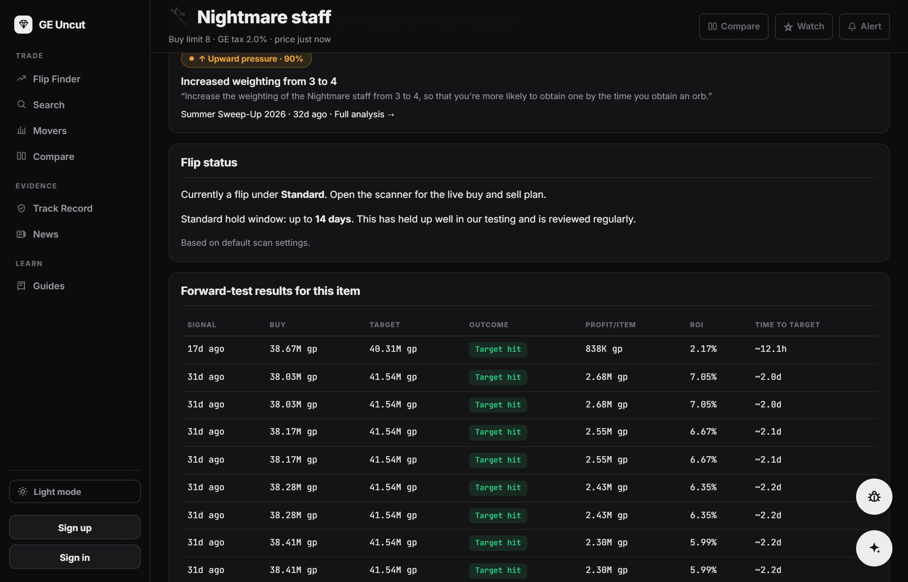

## Deep data on every item

Live spread, daily volume, buy and sell flow, and full price history for any tradeable item.

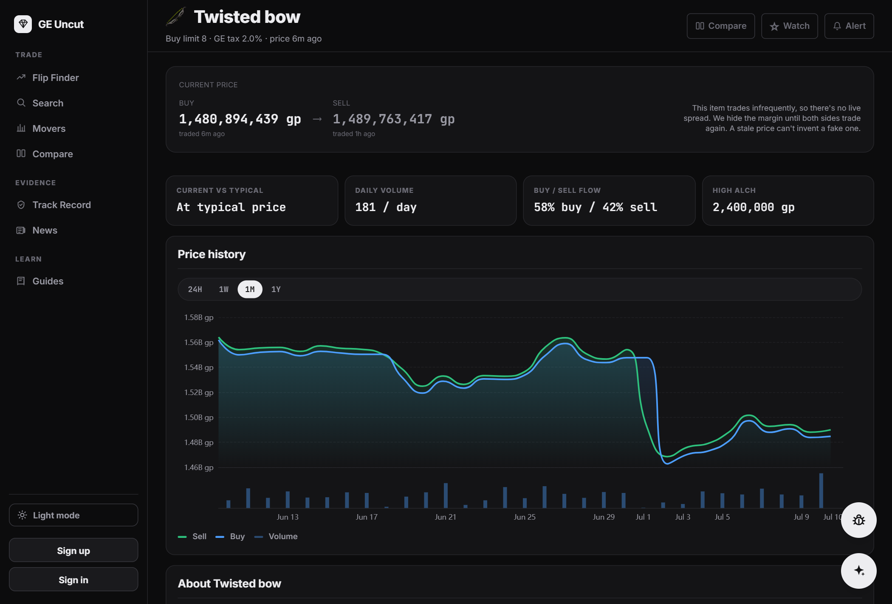

## Built for your phone too

The entire toolkit is fully responsive, so you can scan flips, check movers, and ask the assistant from anywhere.

|  |  |  |
|:--:|:--:|:--:|
| 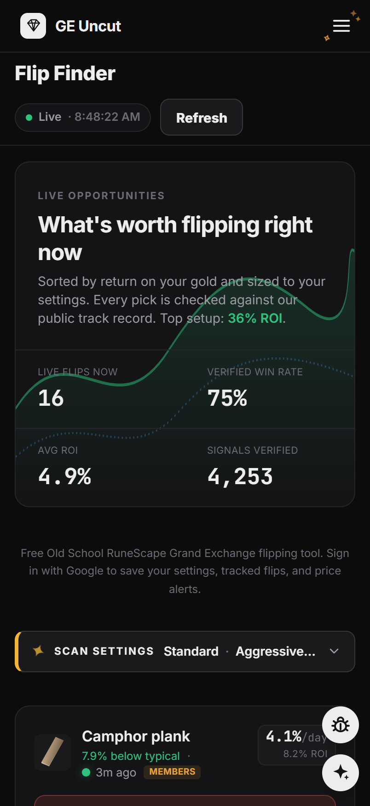 | 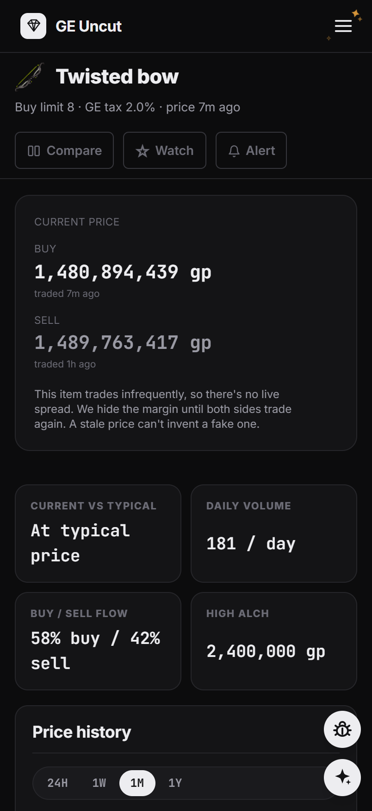 | 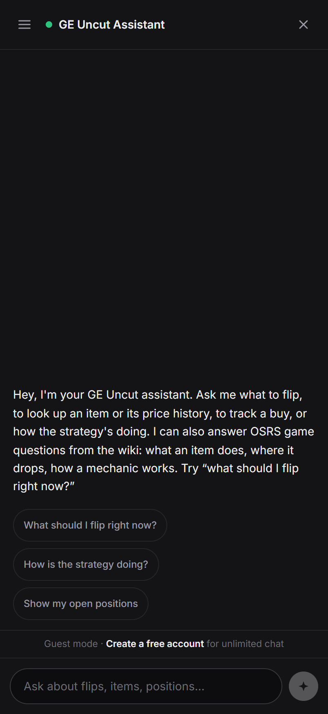 |

---

## Automatic profit tracking

Link your account and the plugin reports your own GE offer fills, so every flip tracks itself in "My Flips" on geuncut.app. No spreadsheets, no manual entry. It also mirrors your live GE slots (working offers) and runs a rolling 4-hour buy-limit timer for every item.

## Linking (optional)

Fully usable without an account. Linking adds members-item flips and cross-device profit tracking. Click **Link account**, enter the short code shown at `geuncut.app/link`, and you are connected. The plugin never sees your RuneScape or geuncut.app password. **Unlink** revokes the token on the server and clears it from the client, so an unlinked device stops resolving immediately.

## Privacy

**Nothing is sent to any server until you link an account.** Unlinked, the plugin only fetches the public flip list (the same anonymous scan the website serves) and does its buy-limit and working-offers tracking locally.

Once linked, the plugin talks to `geuncut.app` only, over HTTPS, using your personal token. It sends your non-reversible OSRS account hash (used to attribute your offers, not your username), your own GE offer fills, and a snapshot of your current GE slots. No credentials are ever transmitted. Every endpoint lives under `https://geuncut.app/api/plugin/`: `flips`, `positions`, `ge-events`, `offers`, `link/start`, `link/poll`, and `link` (unlink).

## Building

Standard RuneLite external plugin. `./gradlew build` compiles and tests; `./gradlew run` launches a developer-mode client with the plugin loaded.

## License

BSD 2-Clause. See [LICENSE](LICENSE).